<div align="center">
  

  <a href="https://github.com/DenverCoder1/readme-typing-svg">
    
  </a>
</div>

<br /><br />

  <!-- BADGES -->
<div align="center">
  <a href="https://visitorbadge.io/status?path=maxecution">
    
  </a>

  <a href="https://github.com/maxecution?tab=followers">
    
  </a>

  <a href="https://mzs.is-a.dev"> 
    
  </a>

<br /><br />

<!-- VALUE STRIP -->

CURIOUS BY NATURE • UX FOCUSED • CO-OP PLAYER • DETAIL ORIENTED

<br />

</div>

```ts
type Tech = 'TypeScript' | 'React' | 'Next.js';

type FocusArea = 'Frontend' | 'UI Design' | 'Testing' | 'Accessibility';

interface Profile {
  readonly name: string;
  readonly role: string;
  readonly stack: readonly Tech[];
  readonly focus: readonly FocusArea[];
  greet(): string;
}

class Engineer implements Profile {
  readonly name = 'Max';
  readonly role = 'Software Engineer';
  readonly stack = ['TypeScript', 'React', 'Next.js'] as const;
  readonly focus = ['Frontend', 'UI Design', 'Testing', 'Accessibility'] as const;

  greet(): string {
    return `Thank you for stopping by. Feel free to explore my work below.`;
  }
}

const me = new Engineer();
me.greet();
```

---

<div align="center">

### Some Stats





</div>

---

<div align="center">

### Project Highlights

**Currently working on** <a href="https://github.com/maxecution/discord-nox-bot">Nox</a>, my first Discord bot.

  <a href="https://github.com/maxecution/my-portfolio">
    
  </a>
  <a href="https://github.com/maxecution/discord-game-news-bot">
    
  </a>
  <a href="https://github.com/maxecution/DRW-helper">
    
  </a>
  <a href="https://github.com/maxecution/discord-nox-bot">
    
  </a>
</div>
